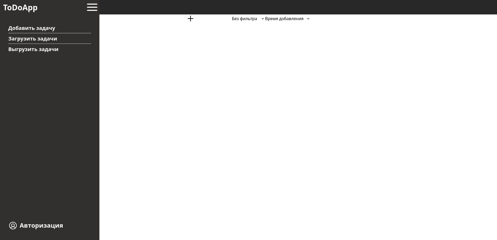
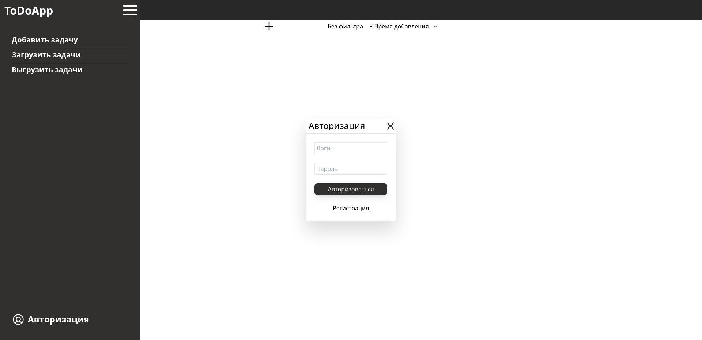
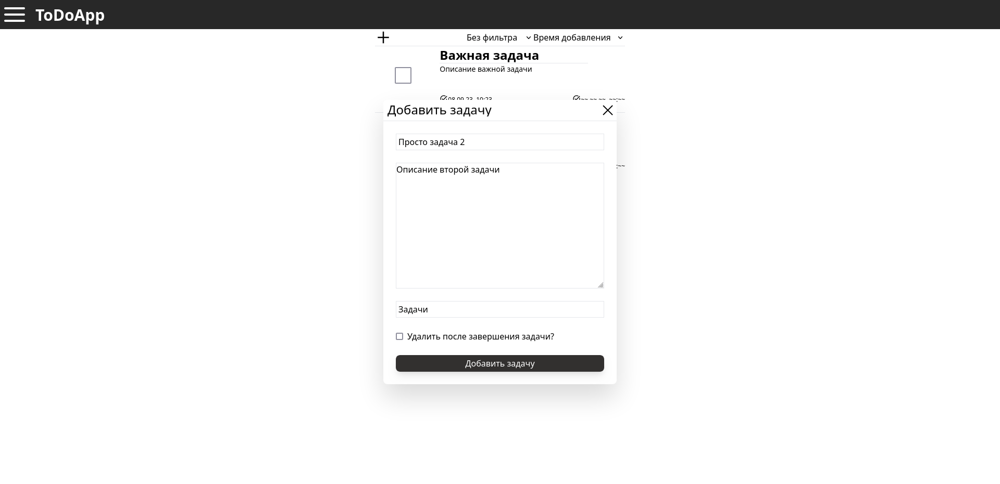
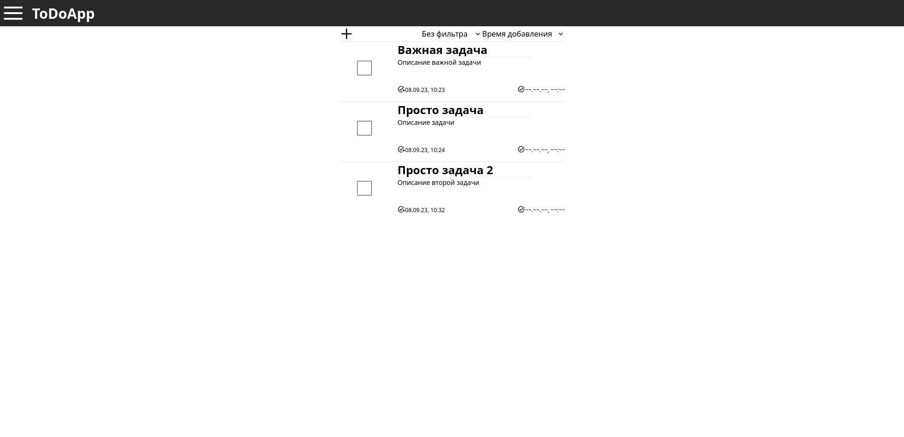
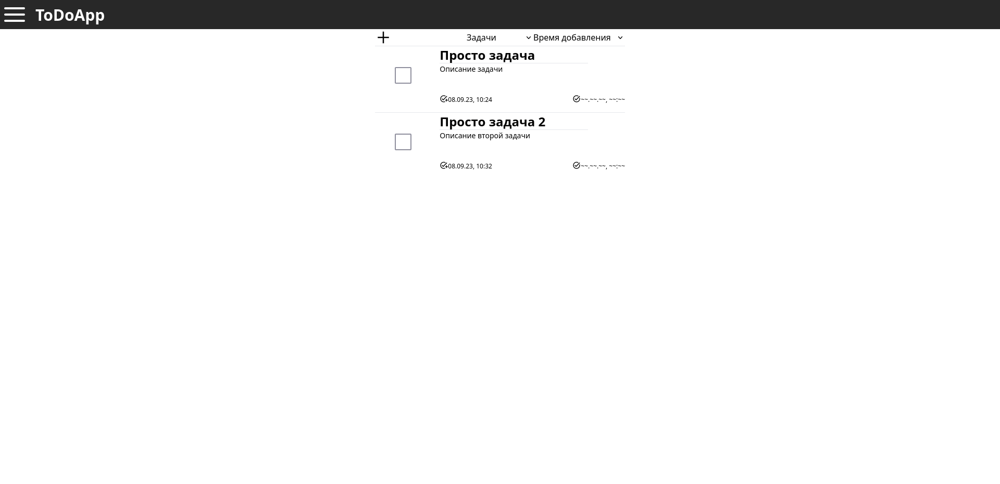
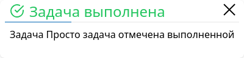

# ToDoApp client

Это простой учебный проект web-приложения - планировщика задач.
Конкретно этот репозиторий - клиент этого приложения.

Ссылка на репозиторий сервера: [ссылка](https://github.com/AlexandrShapkin/ToDoAppServer)  

## Первоначальный дизайн созданный в [figma](https://www.figma.com/)

## Итоговая реализация

  

Главная страница приложения и меню

Авторизация

После авторизации сразу отображается список уже добавленных задач, если таковые имеются

Форма добавления новых задач. Можно указать группы для задач (разделяются при помощи ";")

Список задач сразу обновляется после успешного добавления задачи

Возможна фильтрация задач по группам. Также возможна сортировка по времени добавления, времени выполнения задачи и названию

Всплывающие уведомления. Они отображаются в правом нижнем углу и исчезают по испечению времени. Могут накапливаться в список

### Что еще было реализовано

Также была реализована выгрузка задач в формате .json, и загрузка в том же формате.  
После того как задача отмечена выполненной, у нее полявляется метка о времени, когда она была выполнена. Задачи, которые были помечены для удаления, после выполнения, удаляются автоматически.  
Реализовано редактирование задач.

## Послесловие
Изначально планировалось реализовать гораздо больше функционала, но с началом учебного года, я понял, что мне не хватает времени, для того чтобы выполнять всю работу в университете и успевать, без вреда для себя, заниматься еще и этим учебным проектом.  
В добавок, я допустил некоторые ошибки, еще на стадии первичной реализации, которые начал неудачно исправлять сейчас. Поняв, что правильнее было бы просто не допускать этих ошибок изначально. Я понял, что лучше тогда ничего уже не исправлять, раз у меня хоть как нет времени делать это. А лучше оставить все в плохом, но зато рабочем состоянии.  
Даже при том, что проект оказался в каком-то смысле недоделанным, я хоть как им доволен. Так как в ходе работы над ним, я смог многому научиться, не только в плане разработки на react, но и разработки в целом. Думаю, что полученный опыт пригодится мне в дальнейшем.