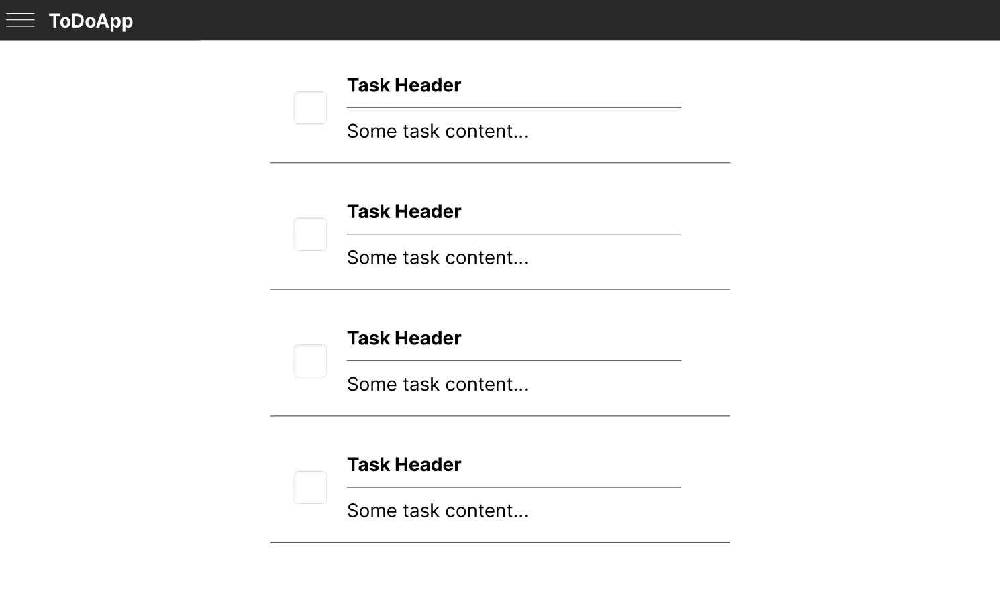
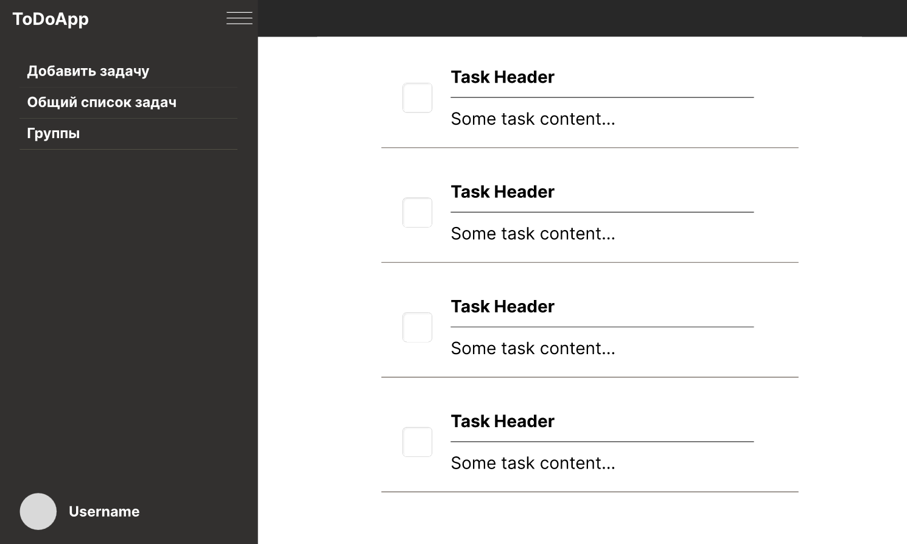

# ToDoApp client

Это простой учебный проект web-приложения - планировщика задач.
Конкретно этот репозиторий - клиент этого приложения.

Ссылка на репозиторий сервера: [ссылка](https://github.com/AlexandrShapkin/ToDoAppServer)  

## Первоначальный дизайн созданный в [figma](https://www.figma.com/)

